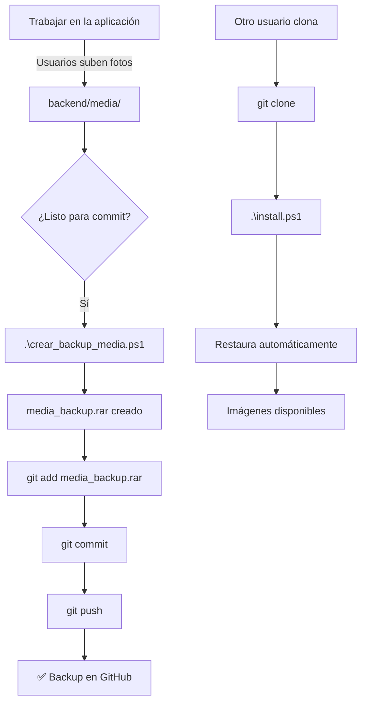

# 🚀 Guía Rápida - Git y Backup de Imágenes

## 📦 Subir Cambios al Repositorio

### 1️⃣ Primera vez (crear backup inicial)

```powershell
# Crear backup de las imágenes actuales
.\crear_backup_media.ps1

# Verificar que se creó el archivo
ls media_backup.rar

# Agregar todos los cambios
git add .

# Commit
git commit -m "Migración a PowerShell + Sistema de backup de imágenes"

# Push
git push origin main
```

### 2️⃣ Actualizaciones futuras (con nuevas imágenes)

```powershell
# Paso 1: Crear backup actualizado
.\crear_backup_media.ps1

# Paso 2: Ver qué archivos cambiarán
git status

# Paso 3: Agregar cambios (excluyendo imágenes directas)
git add media_backup.rar
git add *.ps1
git add .gitignore
# NO agregar: backend/media/usuarios/ ni backend/media/servicios/

# Paso 4: Commit y push
git commit -m "Actualizar imágenes (backup protegido)"
git push
```

---

## 🔍 Verificar Configuración de Git

### Archivos que SÍ deben estar en Git:

```powershell
git ls-files | Select-String -Pattern "install|backup|media"
```

Deberías ver:
- ✅ `install.ps1`
- ✅ `install.bat`
- ✅ `crear_backup_media.ps1`
- ✅ `media_backup.rar` (o `.zip`)
- ✅ `backend/media/usuarios/.gitkeep`
- ✅ `backend/media/servicios/imagenes/.gitkeep`

### Archivos que NO deben estar:

```powershell
# Verificar que estos NO aparezcan en git status
git status --ignored | Select-String -Pattern "media"
```

Deberías ver ignorados:
- ❌ `backend/media/usuarios/*.jpg`
- ❌ `backend/media/servicios/imagenes/*.jpg`
- ❌ `start.ps1` (se genera automáticamente)
- ❌ `media_backup_sin_password.zip`

---

## 📋 Checklist Pre-Commit

Antes de hacer `git push`, verifica:

- [ ] ¿Creaste el backup? → `.\crear_backup_media.ps1`
- [ ] ¿Existe `media_backup.rar`? → `ls media_backup.rar`
- [ ] ¿Las imágenes originales NO están en staging? → `git status`
- [ ] ¿El backup tiene contraseña? → Sí (`proximidad_2025`)
- [ ] ¿Actualizaste la documentación si es necesario?

---

## 🔐 Recordatorios de Seguridad

### ⚠️ NUNCA hacer:

```powershell
# ❌ NO HACER ESTO:
git add backend/media/usuarios/*.jpg
git add backend/media/servicios/imagenes/*.jpg
git add -f backend/media/  # El -f fuerza ignorar .gitignore
```

### ✅ SIEMPRE hacer:

```powershell
# ✅ HACER ESTO:
.\crear_backup_media.ps1
git add media_backup.rar
git commit -m "Actualizar imágenes (backup protegido)"
```

---

## 🎯 Comandos Útiles

### Ver qué archivos están ignorados:
```powershell
git status --ignored
```

### Ver tamaño del repositorio:
```powershell
Get-ChildItem -Recurse -File | Where-Object { $_.FullName -notmatch "node_modules|venv|\.git" } | Measure-Object -Property Length -Sum | Select-Object @{N='Tamaño Total';E={'{0:N2} MB' -f ($_.Sum / 1MB)}}
```

### Limpiar archivos no rastreados (CUIDADO):
```powershell
# Ver qué se eliminaría
git clean -n -d

# Eliminar (solo si estás seguro)
git clean -f -d
```

### Ver historial de commits:
```powershell
git log --oneline --graph --decorate --all
```

---

## 🔄 Flujo de Trabajo Completo



---

## 📊 Comparación de Tamaños

| Método | Tamaño Típico | Seguridad | Recomendado |
|--------|---------------|-----------|-------------|
| Imágenes directas | ~50-500 MB | ❌ Baja | ❌ No |
| ZIP sin contraseña | ~20-200 MB | ⚠️ Media | ⚠️ No |
| ZIP con contraseña | ~20-200 MB | ✅ Alta | ✅ Sí |
| RAR con contraseña | ~15-150 MB | ✅ Muy Alta | ✅✅ Sí |

**El script usa RAR preferentemente para mejor compresión y seguridad.**

---

## 🆘 Solución de Problemas

### Problema: "media_backup.rar no se restaura"

**Solución:**
```powershell
# Extraer manualmente
# 1. Doble clic en media_backup.rar
# 2. Contraseña: proximidad_2025
# 3. Extraer a: backend\media\
```

### Problema: "Archivo muy grande para Git"

**Síntomas:** Error al push por tamaño del backup

**Solución:**
1. Usar Git LFS:
   ```powershell
   git lfs install
   git lfs track "*.rar"
   git add .gitattributes
   ```

2. O optimizar imágenes antes de crear backup:
   ```powershell
   # Reducir calidad/tamaño de imágenes en backend/media/
   # Luego crear backup
   .\crear_backup_media.ps1
   ```

### Problema: "No puedo crear el backup"

**Solución:**
```powershell
# Instalar WinRAR o 7-Zip
# WinRAR: https://www.winrar.es/
# 7-Zip: https://www.7-zip.org/

# Verificar instalación
Get-ChildItem "C:\Program Files\WinRAR\WinRAR.exe"
Get-ChildItem "C:\Program Files\7-Zip\7z.exe"
```

---

## 📝 Plantilla de Commit Messages

```
# Cuando actualizas imágenes:
git commit -m "Actualizar imágenes de servicios (backup protegido)"
git commit -m "Agregar imágenes de nuevos usuarios (backup protegido)"

# Cuando actualizas scripts:
git commit -m "Mejorar script de backup con mejor detección de WinRAR"
git commit -m "Actualizar instalador para soporte de MySQL 8.0"

# Cuando actualizas código:
git commit -m "Implementar nueva funcionalidad en backend"
git commit -m "Corregir bug en vista de servicios"
```

---

## ✅ Lista Final de Verificación

Antes de cerrar:

- [x] Scripts PowerShell creados
- [x] `.gitignore` configurado
- [x] Sistema de backup funcionando
- [x] Documentación completa
- [ ] **TODO:** Crear backup inicial con `.\crear_backup_media.ps1`
- [ ] **TODO:** Primer commit y push al repositorio
- [ ] **TODO:** Probar clonado y restauración en otra máquina

---

**Contraseña del backup:** `proximidad_2025`

**¡No la olvides!** 🔐
